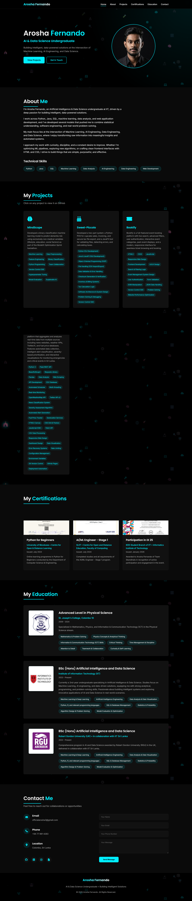

# Arosha Fernando | AI & Data Science Portfolio



This repository contains the source code for my personal portfolio website, built to showcase my projects, certifications, and background in Artificial Intelligence and Data Science.

The site is fully responsive and designed with a modern, tech-inspired aesthetic.

🔗 **Live Demo:**  
https://arosharandew.github.io/PortfolioWebsite/

---

## 📌 Features

- **Hero Section** – Professional introduction with call-to-action buttons  
- **About Me** – Summary of background, interests, and technical skills  
- **Projects Section** – Clickable project cards linking to GitHub repositories with tech stacks  
- **Certifications** – Visual display of earned credentials  
- **Education Timeline** – Clean academic history layout  
- **Contact Form** – Functional email form powered by FormSubmit.co  
- **Social Links** – GitHub, LinkedIn, Instagram, and CV download  
- **Interactive Background** – Animated particles and network lines  

---

## 🛠️ Technologies Used

- **Frontend:** HTML5, CSS3, JavaScript (ES6+)  
- **Icons:** Font Awesome 6  
- **Fonts:** Google Fonts (Poppins, Inter)  
- **Form Handling:** FormSubmit.co  
- **Deployment:** GitHub Pages  

---

## 📸 Screenshots

### 🏠 Home / Hero Section


### 💼 Projects Section


### 🎓 Education & Certifications


### 📬 Contact Section


---

## 🚀 Getting Started

To run this project locally:

```bash
git clone https://github.com/arosharandew/PortfolioWebsite.git
cd PortfolioWebsite
```

Then open:

```
index.html
```

No build tools or dependencies required — this is a pure static HTML/CSS/JS project.

---

## 📂 Project Structure

```
PortfolioWebsite/
│
├── index.html
├── style.css
├── script.js
│
├── images/
│   ├── hero.png
│   ├── projects.png
│   ├── education.png
│   └── contact.png
│
└── AroshaCV.pdf
```

---

## 📬 Contact

- 📧 Email: officialarosha3@gmail.com  
- 💼 LinkedIn: Arosha Fernando  
- 💻 GitHub: @arosharandew  

---

## 📄 License

This project is licensed under the MIT License.

You are free to use it as inspiration for your own portfolio.  
Please provide credit if you reuse substantial portions of the code.

---

## 🙏 Acknowledgements

- Icons by Font Awesome  
- Fonts by Google Fonts  
- Form handling by FormSubmit  
- Hosting by GitHub Pages  
